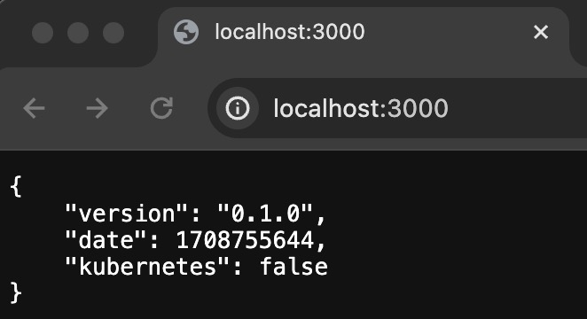
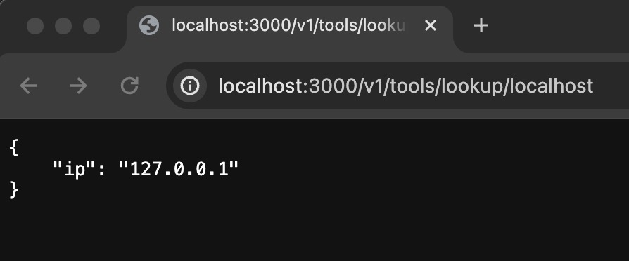
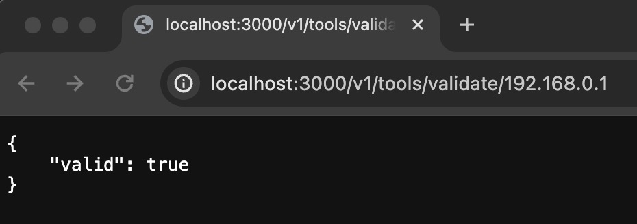
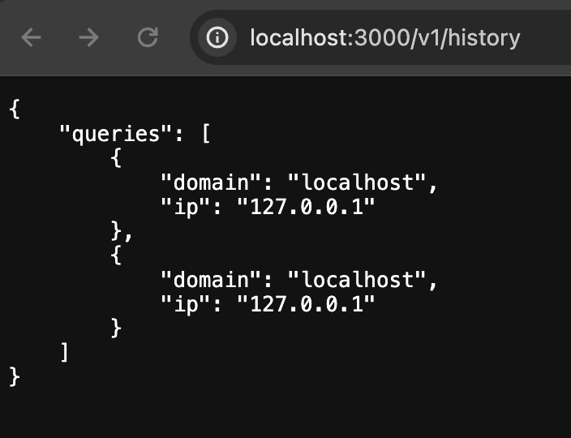
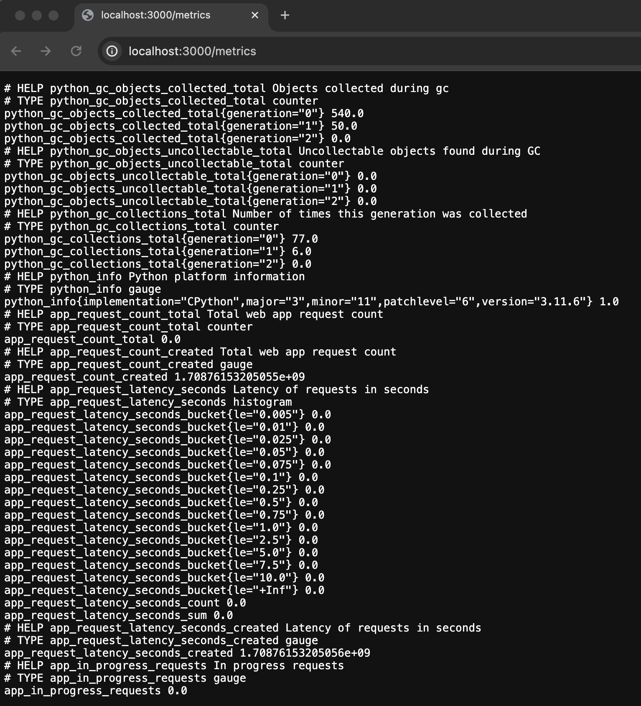
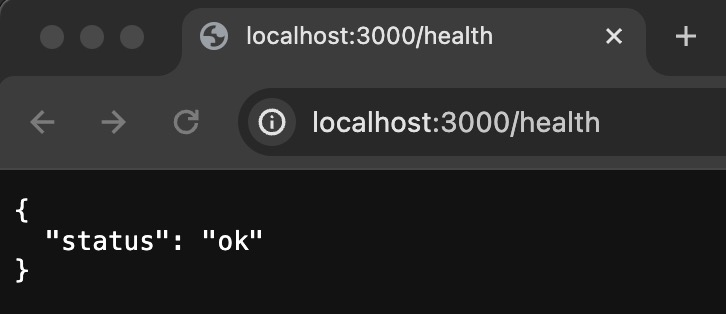

# python-rest-api

## create a local environment

```
python3 -m venv venv
source venv/bin/activate

pip3 install -r requirements.txt
```

## run the app

```
python3 app.py
```

## test endpoint

### / endpoint
```
curl http://localhost:3000

{
    "version": "0.1.0",
    "date": 1708755685,
    "kubernetes": false
}
```


### /v1/tools/lookup endpoint
```
curl http://localhost:3000/v1/tools/lookup/localhost
{
    "ip": "127.0.0.1"
}
```


### /v1/tools/validate endpoint
```
curl http://localhost:3000/v1/tools/validate/192.168.0.1
{
    "valid": true
}
```


### /v1/history endpoint
```
curl http://localhost:3000/v1/history
{
    "queries": [
        {
            "domain": "localhost",
            "ip": "127.0.0.1"
        },
        {
            "domain": "localhost",
            "ip": "127.0.0.1"
        }
    ]
}
```


### /metrics endpoint
```
❯ curl http://localhost:3000/metrics
# HELP python_gc_objects_collected_total Objects collected during gc
# TYPE python_gc_objects_collected_total counter
python_gc_objects_collected_total{generation="0"} 540.0
python_gc_objects_collected_total{generation="1"} 50.0
python_gc_objects_collected_total{generation="2"} 0.0
# HELP python_gc_objects_uncollectable_total Uncollectable objects found during GC
# TYPE python_gc_objects_uncollectable_total counter
python_gc_objects_uncollectable_total{generation="0"} 0.0
python_gc_objects_uncollectable_total{generation="1"} 0.0
python_gc_objects_uncollectable_total{generation="2"} 0.0
# HELP python_gc_collections_total Number of times this generation was collected
# TYPE python_gc_collections_total counter
python_gc_collections_total{generation="0"} 77.0
python_gc_collections_total{generation="1"} 6.0
python_gc_collections_total{generation="2"} 0.0
# HELP python_info Python platform information
# TYPE python_info gauge
python_info{implementation="CPython",major="3",minor="11",patchlevel="6",version="3.11.6"} 1.0
# HELP app_request_count_total Total web app request count
# TYPE app_request_count_total counter
app_request_count_total 0.0
# HELP app_request_count_created Total web app request count
# TYPE app_request_count_created gauge
app_request_count_created 1.70876153205055e+09
# HELP app_request_latency_seconds Latency of requests in seconds
# TYPE app_request_latency_seconds histogram
app_request_latency_seconds_bucket{le="0.005"} 0.0
app_request_latency_seconds_bucket{le="0.01"} 0.0
app_request_latency_seconds_bucket{le="0.025"} 0.0
app_request_latency_seconds_bucket{le="0.05"} 0.0
app_request_latency_seconds_bucket{le="0.075"} 0.0
app_request_latency_seconds_bucket{le="0.1"} 0.0
app_request_latency_seconds_bucket{le="0.25"} 0.0
app_request_latency_seconds_bucket{le="0.5"} 0.0
app_request_latency_seconds_bucket{le="0.75"} 0.0
app_request_latency_seconds_bucket{le="1.0"} 0.0
app_request_latency_seconds_bucket{le="2.5"} 0.0
app_request_latency_seconds_bucket{le="5.0"} 0.0
app_request_latency_seconds_bucket{le="7.5"} 0.0
app_request_latency_seconds_bucket{le="10.0"} 0.0
app_request_latency_seconds_bucket{le="+Inf"} 0.0
app_request_latency_seconds_count 0.0
app_request_latency_seconds_sum 0.0
# HELP app_request_latency_seconds_created Latency of requests in seconds
# TYPE app_request_latency_seconds_created gauge
app_request_latency_seconds_created 1.70876153205056e+09
# HELP app_in_progress_requests In progress requests
# TYPE app_in_progress_requests gauge
app_in_progress_requests 0.0
```


### /health endpoint
```
curl http://localhost:3000/health
{
  "status": "ok"
}
```

